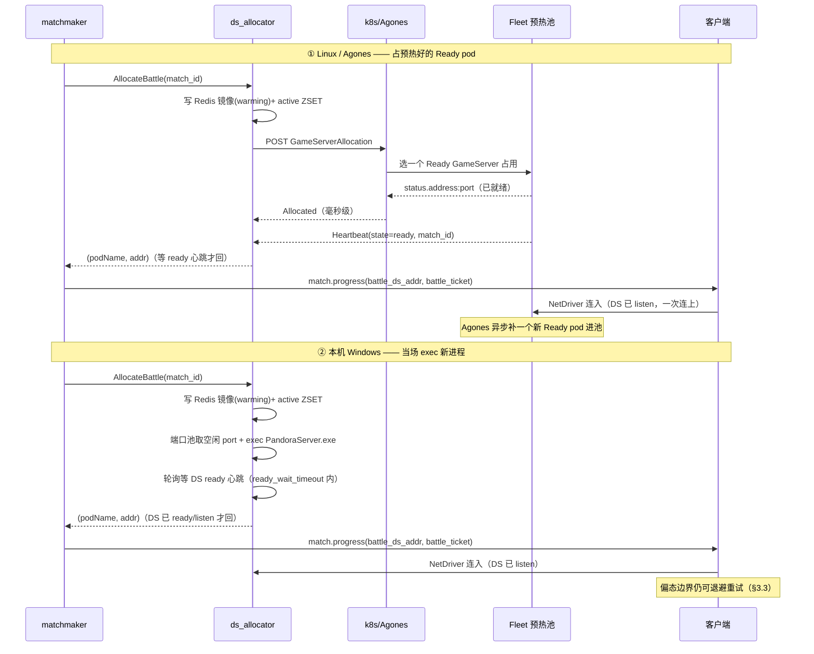
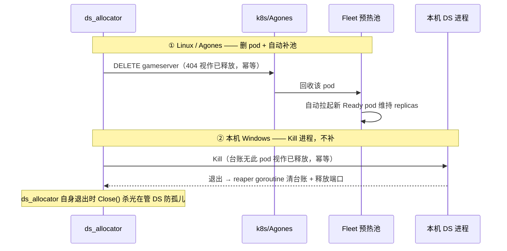

# UE 主链路 + 本地 Agones 联调设计（W4 ⑬）

> 2026-06-09。承接「UE↔后端 gRPC-Web Login + Subscribe + Kafka Push 已通过」，推进 UE 主链路：
> **登录 → 拉/分配 Hub DS → 进大厅 → 匹配 → 拉/分配 Battle DS → 进战斗 → 结算 → 回大厅**。
>
> 本文是设计/契约层；本地 Agones 环境搭建与 apply 命令见 [`deploy/k8s/agones/README.md`](../../deploy/k8s/agones/README.md)。
> UE 侧代码在独立仓库 `Pandora-Client`，命名一律 **Pandora**。

---

## 1. 主链路全景 + 各段责任

```
[UE Client] --gRPC-Web/Envoy--> login.Login
     login --gRPC--> hub_allocator.AssignHub  ──► 真实 hub_ds_addr + hub_ticket(JWT)
[UE Client] --NetDriver--> Hub DS(进大厅, 全图自由 PvP)
     Hub DS --gRPC every5s--> hub_allocator.Heartbeat
     Hub DS --gRPC--> player_locator.SetLocation(HUB)            ← 数据面上报
[UE Client] --gRPC-Web--> matchmaker.StartMatch ... ConfirmMatch
     matchmaker --gRPC--> ds_allocator.AllocateBattle ──► 真实 battle_ds_addr
     matchmaker 签 battle_ticket + player_locator.SetLocation(MATCHING/BATTLE)
     matchmaker --kafka pandora.match.progress--> push --stream--> Client(进战斗通知)
[UE Client] --NetDriver--> Battle DS(5v5 战斗)
     Battle DS --gRPC every5s--> ds_allocator.Heartbeat
     Battle DS --kafka pandora.battle.result--> battle_result(结算 + Elo MMR)
     战斗结束 → Client 回 Hub DS, Hub DS SetLocation(HUB, fence=match_id)
```

### 各段当前状态（后端 vs UE）

| 链路段 | 后端 | UE（Pandora-Client，独立仓库）|
|---|---|---|
| 登录 gRPC-Web | ✅ login（W3）| ✅ `UPandoraBackendSubsystem.Login`（已通）|
| 分配 Hub | ✅ hub_allocator.AssignHub（W4 ⑤/⑥）+ **Agones 发现（W4 ⑬）** | ⬜ NetDriver 连 Hub DS（客户端段）|
| 进大厅 | ✅ login 返真实 hub_ds_addr（agones.enabled=true 后）| ⬜ NetDriver 连 Hub DS |
| Hub 心跳 | ✅ hub_allocator.Heartbeat | 🟡 `APandoraHubGameMode` 骨架已落（每 5s 调，§3 契约）|
| 组队 | ✅ team（W3 ⑦）| ✅ `UPandoraBackendSubsystem` 7 RPC（CreateTeam/Invite/Accept/Leave/Kick/SetReady/GetTeam，§6）|
| 匹配 | ✅ matchmaker（W4 ①/⑦）| ✅ `UPandoraBackendSubsystem` 4 RPC（StartMatch/Cancel/Confirm/GetMatchProgress，§6）|
| 分配 Battle | ✅ ds_allocator.AllocateBattle + **真 Agones（W4 ⑫）** | ⬜ NetDriver 连 Battle DS（客户端段）|
| 进战斗推送 | ✅ kafka match.progress → push stream | ✅ OnPushFrame 已通 |
| Battle 心跳 | ✅ ds_allocator.Heartbeat | 🟡 `APandoraBattleGameMode` 骨架已落（每 5s 调，§3 契约）|
| 结算 | ✅ battle_result（W4 ③/⑨）| 🟡 Battle DS 经 `ReportResult` 同步上报（§5，非 kafka）|
| locator HUB/BATTLE 上报 | ✅ guard + fence（W4 ⑩/⑪）| 🟡 Hub DS `SetLocation(HUB)` 骨架已落（带 fence，§4）|

> **结论**：后端主链路骨架已全部就位；UE DS 后端联调骨架（心跳 / SetLocation / ReportResult）
> 已在 Pandora-Client 落地（见 §5）。**DS gRPC-Web 入口 wiring（§5.1 方案 A）已在本仓库
> envoy.yaml 落地**（:8444 独立 DS 面）。剩余是 (a) 本地 Agones 联调让 allocator 返回真实地址，
> (b) Codex 重启 envoy 容器 + UE DS `SetEndpoints` 指向 :8444，(c) UE NetDriver 连 DS 的客户端段。

---

## 2. Agones 两模型（后端已实现，详见 deploy README §0）

- **战斗 DS = 按需分配**：`ds_allocator/internal/data/agones_allocator.go`（W4 ⑫）POST GameServerAllocation。
- **大厅 Hub DS = 常驻分片**：`hub_allocator/internal/biz/agones_fleet.go`（W4 ⑬）LIST GameServer
  （`agones.dev/fleet=pandora-hub,pandora.dev/region=<region>`），lazy-seed 分片到 Redis。
- 两者 `agones.enabled=false` 默认走 Mock，`=true` 走真 Agones。**biz 逻辑零改**，只换 provider + main 装配。

### 2.1 Hub Fleet 自动扩缩容（2026-06-15）

大厅「常驻分片」在拓扑发现之上加一层**按在线人数自动扩缩容 Hub Fleet 副本**的策略，
走 Agones Fleet 副本控制（直接读/改 Fleet `spec.replicas`），**不引入 FleetAutoscaler CRD**，
后端自己 reconcile（与心跳超时 sweep 同节拍，复用 `hub.sweep_interval`）。

- `HubFleetScaler` 接口（`hub_allocator/internal/biz/fleet.go`）：`GetFleetReplicas` /
  `SetFleetReplicas`。**仅 `AgonesHubFleetProvider` 实现**：GET Fleet 读 `spec.replicas`，
  `application/merge-patch+json` PATCH `{"spec":{"replicas":N}}`（标准库 net/http，零新增依赖）。
  `MockHubFleetProvider` 是拓扑-only **不实现 scaler**（不给退化 no-op，避免门控误判）。
- 门控：`hub.autoscale_enabled=true` **且** provider 实现 scaler（即 `agones.enabled=true` 才有真
  scaler）。Mock 模式下 `scaler==nil` → 自动扩缩容/强制整合恒不运行，进程启动打
  `autoscale_inert_under_mock` 告警；搬迁/回收逻辑本身由 biz 单测覆盖。
- 策略：
  - 开服默认拉起 `hub.min_replicas`（默认 1）个大厅。
  - `desired = ceil(total_players / hub.players_per_hub)`（默认 500/hub），受 `hub.max_replicas`
    （默认 20）上限约束，**稳态只扩不缩**（避免抖动）。
  - 总在线 = 0 → 回收到 `hub.min_replicas`（空大厅自动回收）。
  - `AssignHub` 遇分片全满（`ErrHubNoAvailable`）→ 兜底 `+1` 扩容，上游重试进新大厅。
- Hub Fleet 默认 `replicas: 1`（`deploy/k8s/agones/30-fleet-hub.yaml`，对齐「开服拉起 + 按人数扩」）。
- 阶段限制：当前「空大厅回收」是「总在线=0 才回收到 min」的粗粒度策略；「单大厅空闲 N 分钟回收」
  需再加可配置空闲阈值 + 逐分片空闲计时（留后续）。真集群验 PATCH 扩缩容需 `agones.enabled=true`
  + minikube/Agones 环境（Codex/人）。

### 2.2 强制整合 + 玩家迁移通知（2026-06-15）

在 §2.1「空大厅回收」之上加**主动整合**：低负载时不等大厅自然空，而是**强制把人少的大厅排空、
服务端权威搬迁玩家到该去的大厅，并在切换前给玩家提示**。门控 `hub.consolidation_enabled=true`
（且 `hub.autoscale_enabled=true`）。

- **谁被排空**：reconcile 算 `need = ceil(total_players / players_per_hub)`，ready 分片多于 need
  时按负载升序选**最空的多余分片**标 `draining` + 盖 `draining_since_ms`，保留最满的 need 个分片。
- **怎么搬**：逐分片每 tick 最多搬 `hub.consolidation_batch`（默认 50）人到同 region 最空 ready
  分片，搬迁顺序镜像 `TransferHub`（占新位 → 切归属 → 退旧位）+ 重签 hub 票据，**服务端权威**
  （归属立即转移，账面即时一致；物理玩家最多滞留 `migrate_grace_seconds`）。
- **切换前提示（双通道，互为兜底）**：
  - **通道 A — Hub DS drain 心跳指令**：draining 分片的 Hub DS 下次 `Heartbeat` 收
    `command="drain"` + `grace_seconds`（默认 30）。UE Hub DS 据此弹场内 UMG「N 秒后切换大厅」
    倒计时，到点强制重连（重连走 `AssignHub` 幂等返回迁移后新分片）。
  - **通道 B — Kafka 推送 `pandora.hub.migrate`**：后端搬迁完成按 `key=player_id` 推
    `HubMigrateEvent{from_hub_pod, to_hub_ds_addr, to_hub_ticket, to_hub_pod_name, to_shard_id,
    grace_seconds, reason="consolidation", ts_ms}` → push 服务转发 → 客户端可无缝倒计时后用新
    票据直连新大厅。漏听推送的玩家靠通道 A 兜底。
- **何时缩 pod**：draining 分片**已排空（player_count=0）且过 `migrate_grace_seconds`**后才
  `RemoveShard` + 降 Fleet `spec.replicas`，避免提前杀 pod 打断在场玩家倒计时。
- **阶段限制**：降 `spec.replicas` 后 **Agones 自行挑 GameServer 删，不保证就是被排空那个**；当前
  靠「只在排空且过 grace 后才缩容」规避（被删 pod 已无在场玩家），精确按 pod 删除待接 Agones
  game-server-shutdown SDK 再细化。成员反向索引（`pandora:hub:shard:members:{<pod>}`）是
  best-effort（TTL=assignment_ttl），漂移不影响正确性——通道 A 兜底。cpp pb 同步到 UE 仓库
  留 Codex/人。
- **首次整合降级（部署前已在线的老玩家）**：成员反向索引**只在 `AssignHub`/`TransferHub` 时写入**，
  部署/上线整合功能**之前**就已在线、已有 assignment 的老玩家不在 set 里。`drainAndMigrate` 只枚举
  set 成员，**不会对这些老玩家做通道 B 的服务端权威搬迁 + 推送**；他们靠**通道 A（Hub DS drain 心跳
  → 客户端重连 `AssignHub`）兜底**：幂等路径发现旧分片非 `ready` → 释放旧位重分到 ready 分片，旧分片
  `player_count` 随之递减，**最终一致 + 分片可回收**，只是少了无缝推送体验。降级窗口受 set TTL
  （=assignment_ttl，默认 30min）约束——活跃老玩家每次 `AssignHub`（含重连自愈）都会补回索引。
  `drainAndMigrate` 在 `len(members) < player_count` 时打 `drain_members_index_incomplete` 告警便于观测。
  若后续要对老玩家也做服务端权威搬迁，需让 Hub DS 心跳/上报带成员列表或加索引 backfill（非本期范围）。
- **空大厅缩容防 stale 镜像**：总在线=0 时**不直接把 Fleet 缩到 min**，而是先把超出 `min_replicas`
  的空 ready 分片标 `draining` + 盖 `draining_since_ms`，交回收路径删镜像后再降 `spec.replicas`。
  否则盲缩 Fleet → Agones 删掉的 pod 只会被心跳超时扫成「无 `draining_since_ms`」的 `draining` 分片，
  `reclaimDrainedShards` 跳过它 → 镜像变成不可回收的 stale shard 残留在 `pandora:hub:shards` 集合里。

### 2.3 匹配成功 → Agones 拉起新 Linux Battle DS 完整调用链

> 本节回答「匹配成功后 Agones 怎么启动新的 Linux DS」的完整链路。**关键先纠正一个直觉误区**:
> Agones **不是在匹配成功那一刻才「冷启动」一个 Linux DS pod**。`pandora-battle` Fleet 预热保持
> `replicas`(dev=2)个**已经在运行、已 Ready** 的 Battle DS pod。匹配成功时 `GameServerAllocation`
> 只是**从预热池里挑一个 Ready 的占走(标 Allocated)**——这一步是毫秒级,不用等 UE Linux DS 冷启动。
> 被占走后,**Fleet 控制器异步再拉起一个新 pod 补回 Ready 缓冲**(这才是「Agones 启动新 Linux DS」
> 的真实时机:发生在分配**之后**为补池,不在玩家进战斗的关键路径上)。

#### 调用链(从客户端确认匹配到玩家拿到 Battle DS 地址)

```
① [UE Client] --gRPC-Web/Envoy:8443--> matchmaker.ConfirmMatch(match_id, accept=true)
        services/matchmaking/matchmaker/internal/service → biz.ConfirmMatch
        UpdateMatchWithLock: 标记该玩家 Confirm
        allAccepted(members) == true → Stage=ALLOCATING, outcome=outcomeAllReady
        触发 ▼

② matchmaker biz.onAllConfirmed(match)                     [biz/match.go:367]
        playerIDs := memberPlayerIDs(match.Members)
        dsAddr, tickets, err := u.allocator.AllocateBattle(ctx, matchID, playerIDs)  ▼

③ matchmaker data.GrpcDSAllocator.AllocateBattle           [data/ds_allocator.go]
        --gRPC unary--> ds_allocator.AllocateBattle(match_id, player_ids, map_id, game_mode)  ▼
        (拿到 ds_addr 后) 为每个玩家 signer.SignDSTicket(pid, DSTypeBattle, match_id, uuid)
        → battle DSTicket(JWT, 5min, 不变量 §3;DS 不可信,票据由可信后端签 不变量 §6)

④ ds_allocator biz.AllocateBattle(match_id, ...)           [ds_allocator biz/allocator.go]
        幂等检查: repo.GetBattle(match_id) 命中且已有分配后有效心跳(ready/running) → 直接回已有 ds_addr;
          命中但仍 warming → 继续等 ready 心跳;终态/不可用 → 分配失败(防 matchmaker 重试重复拉 DS)
        未命中 ▼
        podName, addr, err := u.alloc.Allocate(ctx, matchID, mapID, gameMode)  ▼

⑤ ds_allocator data.AgonesGameServerAllocator.Allocate     [data/agones_allocator.go]
        构造 GameServerAllocation JSON:
          apiVersion: allocation.agones.dev/v1
          spec.selectors[0].matchLabels: { agones.dev/fleet: pandora-battle }
          spec.metadata.labels: { pandora.dev/match-id, map-id, game-mode }  ← 打业务标签便于排障
        --HTTP POST(带 ServiceAccount Bearer token + CA)-->
          {apiServer}/apis/allocation.agones.dev/v1/namespaces/{ns}/gameserverallocations  ▼

⑥ 【Agones controller(k8s 集群内)】★ Linux DS 真正被「占用/补充」的地方
        - 从 pandora-battle Fleet 的 Ready 池里挑 1 个 GameServer → 标 Allocated(毫秒级,不冷启动)
        - Fleet 控制器发现 Ready 数 < replicas → 异步 kubelet 拉起 1 个新 Battle DS pod 补回缓冲
          (UE Linux Dedicated Server 容器冷启动,Agones SDK Ready 后进池,供下一场匹配用)
        - 返回 status.state=Allocated + gameServerName + address + ports[0].port  ▲

⑦ AgonesGameServerAllocator.Allocate 解析响应
        state=="Allocated" 才算成功(UnAllocated/Contention → ErrDSNoAvailable 5001)
        addr = "{status.address}:{status.ports[0].port}"
        返回 (gameServerName, addr)  ▲

⑧ ds_allocator biz 写 warming 镜像 → 等 DS 心跳 ready → 返回
        ⚠ Agones state=Allocated 只说明 pod 被分配,不代表 DS 进程已读到 pandora.dev/match-id;
          若此时就把 ds_addr 回给 matchmaker,客户端太快连入时 DS 内部 match_id 仍为 0,PreLogin 会拒票。
        repo.CreateBattle(BattleStorageRecord{match_id, ds_pod_name, ds_addr, state=warming,
          player_ids, allocated_at_ms, last_heartbeat_ms=now, ...}) → Redis pandora:ds:battle:{match_id}
        同步登记 active ZSET(score=last_heartbeat_ms,供心跳超时 sweep,不变量 §4)
        waitBattleReady: 轮询镜像等 DS 用正确 match_id/pod 的 Heartbeat 上报 ready/running
          (last_heartbeat_ms 严格大于 allocated_at_ms,即真实心跳),最长等 ready_wait_timeout(默认 10s)
          • 等到 → 心跳已刷新 active score,返回 AllocateResult{DSAddr, DSPodName}  ▲
          • 超时/ctx 取消 → 用独立 cleanup ctx 回收 pod + 删镜像,返回分配失败(绝不回 ds_addr)

⑨ 回到 matchmaker biz.onAllConfirmed
        UpdateMatchWithLock: Stage=READY, BattleDsAddr=dsAddr
        notifyBattle → player_locator.SetLocation(BATTLE)(标记玩家在该 DS,不变量 §1)
        对每个玩家 pushOne: kafka pandora.match.progress
          MatchProgress{stage=READY, battle_ds_addr=dsAddr, battle_ticket=各自 JWT}  ▼
        删票据、移出 active(玩家已进战斗)

⑩ push 服务消费 pandora.match.progress(key=player_id)→ server stream 推给客户端「进战斗通知」  ▼

⑪ [UE Client] 收到 MatchProgress{READY, battle_ds_addr, battle_ticket}
        --UE NetDriver(UDP)--> 连 Battle DS(带 battle_ticket 校验)

⑫ 被分配的 Battle DS(UE Linux DS)开始服务
        --gRPC unary 每 5s--> ds_allocator.Heartbeat(刷新 last_heartbeat_ms,不变量 §4)
        战斗结束 --kafka pandora.battle.result--> battle_result(结算 + Elo MMR)
```

#### 关键点与不变量

- **预热 vs 冷启动**:玩家关键路径上拿到的是**预热好的 Ready DS**(步骤 ⑥ 毫秒级占用);Agones
  「启动新 Linux DS」是**分配后异步补池**(不阻塞玩家进战斗)。要让首场分配就有 DS 可用,
  `pandora-battle` Fleet 的 `replicas` 必须 ≥ 预期并发开局数。
- **职责切分**:`ds_allocator` 只「拉 pod 返地址」**不签票据**;battle DSTicket 由 `matchmaker` 用
  `pkg/auth.Signer` 签(不变量 §3 短时效 5min + §6 DS 不可信)。
- **幂等**:步骤 ④ 同 `match_id` 已有镜像直接回,防 matchmaker 重试导致重复 `GameServerAllocation`
  浪费 Fleet 容量。
- **provider 无关**:步骤 ⑤ 用标准库 `net/http` 直连 k8s apiserver REST,不引 agones/client-go;
  minikube / ACK / 自建集群上的 Agones 分配 API 一致。`agones.enabled=false` 时步骤 ⑤ 换成
  `MockGameServerAllocator`(按 match_id 算确定性假地址,本地无 k8s 也能跑通 ②-⑪)。
- **无空闲 DS**:Fleet 池被占满(`state != Allocated`)→ `ErrDSNoAvailable(5001)` → matchmaker
  `onAllConfirmed` 收到错误 → `onMatchFailed` 整场失败、票据退回队列。生产需配 FleetAutoscaler
  或足够 `replicas` 兜底。
- **故障补偿**:Battle DS 崩溃/心跳超时(15s)→ `ds_allocator` `RunHeartbeatSweep` 标 `abandoned` +
  `GameServerAllocation` 对应 GameServer Release + 发 `pandora.ds.lifecycle` 给 battle_result 段位
  回滚(不变量 §4,W4 ⑧ at-least-once)。

### 2.4 本机 Windows Battle DS 调试模式（2026-06-16，与 Agones 并列的第二种启动方式）

调试 / 本机联调时不一定有 minikube + Agones,可让 `ds_allocator` 直接在本机 `exec` 打包好的
**UE Windows Dedicated Server** 进程,走完整匹配链路拿到真实可连地址,无需 k8s。三种 DS 启动方式
**互斥**,由 `ds_allocator` 配置选装配(`biz.GameServerAllocator` 接口零改,Mock/Agones/Local 三实现):

| 模式 | 配置 | 实现 | 用途 |
|---|---|---|---|
| Agones | `agones.enabled: true` | `data.AgonesGameServerAllocator` | Linux 生产(GameServerAllocation) |
| **Local Windows** | `local_ds.enabled: true` | `data.LocalGameServerAllocator` | 本机 Windows DS 进程调试 |
| Mock | 两者都 false(默认) | `biz.MockGameServerAllocator` | 确定性假地址,无真实 DS |

- ⚠️ `agones.enabled` 与 `local_ds.enabled` **不能同时为 true**(main 启动 fatal `ds_backend_conflict`)。
- **Allocate**:`exec` `local_ds.executable_path`,在 `[port_base, port_base+port_range)` 取空闲端口,
  命令行 `<map_name> -server -log -port=<port>` + `extra_args`;注入 env `AGONES_GAMESERVER_NAME`/
  `PANDORA_MATCH_ID`/`PANDORA_MAP_ID`/`PANDORA_GAME_MODE`(对齐 UE DS 侧 `PandoraAgonesProvider` 读取),
  返回 `advertise_host:port`(默认 `127.0.0.1`)。同 `match_id` 幂等(已在台账直接回原地址)。
- **Release / abandoned**:`Kill` 对应进程;台账无此 pod 视作已释放(幂等)。`ds_allocator` 进程退出
  时 `Close` 杀光在管 DS,避免遗留孤儿。进程自行崩溃由 reaper goroutine 清理台账释放端口(镜像仍靠
  心跳超时 sweep 标 abandoned,与 Agones pod 崩溃同语义)。
- **DS stdout/stderr** 落 `local_ds.log_dir`(默认 `run/dev/logs/ds`)下 `<pod>.log`,便于调试。
- **配置示例**见 `services/battle/ds_allocator/etc/ds_allocator-dev.yaml` 的 `local_ds` 段;打包好的
  UE Windows Server 在 `C:\work\Pandora-Client-SVN`(SVN 客户端工程)下,`executable_path` 指向其
  `PandoraServer.exe`。
- **职责切分不变**:Local 模式同样只「拉进程返地址」,battle DSTicket 仍由 `matchmaker` 签;客户端经
  `pandora.match.progress` 推送拿到 `battle_ds_addr` + `battle_ticket` 后用 NetDriver 连入本机 DS。

#### Linux(Agones)vs 本机 Windows 时序对比

`Allocate` 分叉:Agones 从**预热池占现成 Ready pod**(毫秒级),Local 是**当场 exec 新进程**;
两路拿到 pod 后 `ds_allocator` 都**先把镜像写 `warming`、阻塞等 DS 上报 `ready` 心跳才回地址**
(见 §1 流程 ⑧、`ready_wait_timeout` 默认 10s)。所以客户端拿到地址时 DS 一般已 `listen`,
首连基本成功;§3.3 的退避重试只作边界兜底(Local 冷启动慢时 ready 心跳来得晚,等待窗口更长)。



`Release` 分叉:Agones DELETE pod 后 **Fleet 自动补一个新 Ready pod**(池子恒维持 `replicas`);
Local `Kill` 进程后 **不补**,端口立即归还池子,下一局匹配才再 exec。



### 2.5 UE 5.7 Launcher / 源码版 / Installed Build 网络兼容性（2026-06-16）

UE 客户端能否连上 DS,核心看 `FNetworkVersion` 的输入是否一致,尤其是
`CompatibleChangelist`、UE 版本号和 `IsLicenseeVersion`。当前已确认:

| 引擎 | CompatibleChangelist |
|---|---:|
| Launcher `UE_5.7` | `47537391` |
| 源码版 `D:\UnrealEngine` | `47537391` |

因此当前个人联调阶段可以使用 **Launcher UE_5.7 客户端 + 源码版 `D:\UnrealEngine` DS**,
前提是**不改引擎源码、不改 `Build.version`、不重新同步到不同 CL**。在这个前提下,
两边 `CompatibleChangelist` 一致,网络兼容。

Installed Build 不是天然不兼容。它从源码版引擎产出,默认会继承源码版的版本信息;只要产出后的
`Build.version` 仍保持 `CompatibleChangelist=47537391`,就仍可与 Launcher `UE_5.7` 客户端兼容。
风险在于 BuildGraph 产 Installed Build 时可能显式写入或改写 changelist;如果产出结果变成其它
`CompatibleChangelist`,就可能与 Launcher 客户端网络版本不一致。

阶段纪律:

| 阶段 | 客户端引擎 | 服务器引擎 | 兼容性要求 |
|---|---|---|---|
| 个人打通链路 | Launcher `UE_5.7` | 源码版 `D:\UnrealEngine` | 已验证 CL 一致;不改引擎源码 / `Build.version` |
| 团队规模化 | 同一个 Installed Build | 同一个 Installed Build | 推荐方案,单一引擎天然一致 |
| 不推荐但可临时用 | Launcher `UE_5.7` | Installed Build | 必须人工确认产物 `CompatibleChangelist=47537391` |

**一劳永逸的团队方案**:一旦团队上 Installed Build,客户端和服务器都用同一个 Installed Build 出包,
不要长期维护「客户端 Launcher、服务器 Installed Build」两套引擎。这样只有一个引擎版本源,
不会再靠人工对齐网络版本。

验收要求:每次产出 Installed Build 或更换 DS 引擎前,检查产物 `Build.version` 的
`CompatibleChangelist` 是否仍与当前客户端引擎一致;不一致时先停下确认,不要直接进入联调。

---

## 3. DS 业务心跳上报契约（UE 侧实现）

⚠️ **Agones SDK health ≠ Pandora 业务 Heartbeat**。前者让 GameServer 进 Ready（Agones 调度用），
后者是 DS 向 allocator 上报负载/状态（容量判定 + 心跳超时补偿，不变量 §4）。UE DS 两者都要做。

### 3.1 Hub DS → `hub_allocator.Heartbeat`（每 5s 单向 unary）

`HeartbeatRequest`（`pandora/hub/v1/allocator.proto`）：

| 字段 | UE 填法 |
|---|---|
| `hub_pod_name` | Agones GameServer 名（环境变量 / SDK `GameServer().ObjectMeta.Name`）|
| `player_count` | 当前在线人数（hub_allocator 回写对账）|
| `cpu_pct` / `mem_mb` | 进程负载（可选，先填 0）|
| `state` | `"ready"` / `"draining"` / `"stopping"` |
| `ts_ms` | `now` 毫秒 |

响应 `command`：`""`=继续；`"drain"`=停止接新 **+ 强制整合排空**；`"stop"`=自行停机（孤儿分片）。

> `command="drain"` 同时带 `grace_seconds`（强制整合时为 `hub.migrate_grace_seconds`，默认 30）。
> UE Hub DS 收到 `drain` 应：① 停止接新玩家；② 弹场内 UMG「N 秒后切换大厅」倒计时；③ 到点
> 强制玩家重连（`AssignHub` 幂等返回迁移后的新分片）。配合后端 `pandora.hub.migrate` 推送可做
> 无缝切换（见 §2.2 双通道）。allocator 标 `draining` 后不会被 DS 上报的 `ready` 降级。

### 3.2 Battle DS → `ds_allocator.Heartbeat`（每 5s 单向 unary）

`HeartbeatRequest`（`pandora/ds/v1/allocator.proto`）：

| 字段 | UE 填法 |
|---|---|
| `ds_pod_name` | Agones GameServer 名 |
| `match_id` | 本对局 match_id（从 battle_ticket / 分配时下发取）|
| `player_count` | 当前战斗内人数 |
| `state` | `"warming"` / `"ready"` / `"running"` / `"ended"` |
| `ts_ms` | `now` 毫秒 |

响应 `command`：`""`=继续；`"stop"`=自行停机（孤儿 DS）。

> **心跳超时（Battle 默认 15s,Hub 默认 30s）→ allocator sweep 标记 abandoned/draining**，Battle DS abandoned 经
> `pandora.ds.lifecycle` 触发 battle_result 段位回滚补偿（W4 ⑧ at-least-once 闭环）。
>
> 补偿链两段都可在 UE DS 就绪前用 stub 端到端验：
> - 第一段（DS 心跳超时 → abandoned → `ds.lifecycle`）：`tools/scripts/ds_heartbeat_stub.ps1`
>   起 Battle DS 心跳后停掉，观察 sweep 标 abandoned + `ds_lifecycle_published`。
> - 第二段（battle_result 事务出箱 → `player.update` → player 段位回滚）：
>   `tools/scripts/battle_result_outbox_probe.ps1`（grpcurl 同步 ReportResult，验 NORMAL Elo 守恒 /
>   ABANDONED delta 全 0 / 幂等 / outbox 清零，见 W4 ⑨）。
### 3.3 客户端连入 Battle DS 的重试契约（UE 客户端侧实现）

⚠️ **本机 Windows DS 调试模式（§2.4）特有的「地址已下发但 DS 还没 listen」窗口必须靠客户端重试兜底。**

- **背景**:`ds_allocator.AllocateBattle` 现在会先把镜像写 `warming`,**阻塞等 DS 用正确 match_id/pod
  的 Heartbeat 上报 `ready`/`running`** 才把 `battle_ds_addr` 回给 matchmaker(超 `ready_wait_timeout`
  默认 10s 未就绪 → 回收 pod + 分配失败)。因此客户端拿到地址时 DS 通常已在 `listen`,
  首连成功率大幅提升;但付压/心跳与 `listen` 就绪间仍可能有毫秒级窗口,重试仍作兜底。
  (本机 Windows 调试模式、Agones Linux 生产两路径现在都走该 ready 门控,客户端不必分叉。)
- **客户端契约**(`match.progress` 推到 `MatchStage=READY` 拿到 `battle_ds_addr` + `battle_ticket` 后):
  1. 用 `ClientTravel` / `NetDriver` 连 `battle_ds_addr`,失败不立即报错。
  2. **指数退避重试**:建议初始 0.5s,倍增到上限 2s,**总预算 ≥ 30s**(覆盖本机冷启动 UE DS 的最坏耗时)。
  3. 重试期间 UMG 显示「正在进入战斗…」,不弹失败弹窗;超过总预算才报错并回大厅。
  4. 携带的 `battle_ticket` 不变(5min 有效,重试窗口远小于此,无需重新拿票据)。
- **生产(Agones)同样建议保留这套重试**:网络抖动 / pod 刚 Ready 的边界仍可能首连失败,重试让两种
  方式客户端代码**一致**,不必为调试/生产分叉(只是 Agones 下几乎一次连上,退避循环基本不触发)。
- **后端表现**:DS 起好后正常每 5s 调 `ds_allocator.Heartbeat`(§3.2);镜像先以 `warming` 写入,
  后端等首个带正确 match_id/pod 的心跳把它翻成 `ready`/`running` 后才下发 `battle_ds_addr`;
  之后的心跳只续期 + 容量对账。

---

## 4. player_locator HUB/BATTLE 上报闭环契约（UE 侧实现）

后端守卫（W4 ⑩/⑪）已就位：用 state 识别写入方权威，HUB 上报带 `match_id` 作 fence。
**MATCHING/BATTLE 由 matchmaker 写（控制面），HUB 由 Hub DS 写（数据面）**。UE Hub DS 负责 HUB 上报：

### 4.1 玩家进 Hub DS → `player_locator.SetLocation(HUB)`

`SetLocationRequest{ player_id, Location{ state=LOCATION_STATE_HUB, hub_pod, shard_id, match_id } }`：

| 场景 | `match_id` 填法（fence 令牌）|
|---|---|
| 全新登录进大厅 | `0`（无来源对局）|
| **战斗结束回大厅** | **填刚结束那场的 match_id**（从 battle DSTicket 取）|

- 后端 guard：`cur=BATTLE` 时，仅当 `in.match_id == cur.match_id && != 0` 才允许 `BATTLE→HUB`
  回流（合法）；不匹配/为 0 = stale hub DS 顶 active BATTLE → 拒 `ERR_LOCATOR_CONFLICT=9202`。
- 后端持久化 HUB 记录时**清零 match_id/battle_pod**（fence 仅供判定，进 HUB 后无活跃对局）。
- `cur=MATCHING`（确认期 ~15s）时 HUB 上报一律拒（玩家物理上还连着 hub，但权威态是 MATCHING）。

### 4.2 时序要点（避免顶号冲突）

- Hub DS 进大厅那刻才 SetLocation(HUB)，不要在 matchmaker 写 MATCHING 后还重复刷 HUB。
- 战斗结束回流必须带 fence match_id，否则会被后端正确拒绝（这是防 stale 的设计，不是 bug）。

---

## 5. UE Hub DS / Battle DS 骨架要点（Pandora-Client 仓库，命名 Pandora）

> 仅列后端联调相关的骨架职责；GAS / Iris / Replication 细节见 `ds-arch.md`。

**🟡 已落地（2026-06-09，Pandora-Client `Source/Pandora/`）**：

| 文件 | 职责 |
|---|---|
| `Public/Net/PandoraDSBackendSubsystem.h` + `Private/Net/...cpp` | DS→后端 4 个 unary（HubHeartbeat / BattleHeartbeat / SetLocationHub / ReportBattleResult），复用 gRPC-Web codec |
| `Public/Server/PandoraAgonesProvider.h` + cpp | Agones 身份/生命周期桩（读 env：`AGONES_GAMESERVER_NAME` / `PANDORA_MATCH_ID` / `PANDORA_REGION`），Ready/Health/Shutdown 占位 |
| `Public/Server/PandoraHubGameMode.h` + cpp | 大厅 DS：5s 心跳 + PostLogin 落 `SetLocation(HUB)`（带 fence match_id，§4） |
| `Public/Server/PandoraBattleGameMode.h` + cpp | 战斗 DS：5s 心跳 + `ReportResultAndEndMatch`（结算同步上报，不报 mmr_delta，§6） |
| `Public/Auth/PandoraDSTicket.h` + `Private/Auth/...cpp` | DS 侧 DSTicket 本地校验器（自带 HMAC-SHA256 零依赖 + base64url + JSON claims，HS256 验签/exp/iss/aud/ds_type/match_id），dev=HS256 生产切 RS256 |
| `Public/Gameplay/Default/PandoraDSGameModeBase.h` + cpp | DS GameMode 校验基类（派生 `AMyGameMode`）：`PreLogin`/`InitNewPlayer` 验票、`jti` 防重放、`PostLogin` 单会话顶号、roster 名单 |
| `Public/Gameplay/Default/PandoraBattleGameMode.h` + cpp | 战斗 DS GameMode：`ds_type=battle` + 强制 `match_id` 绑定（从 `UPandoraAgonesSubsystem` 取）+ roster |
| `Public/Gameplay/Default/PandoraHubGameMode.h` + cpp | 大厅 DS GameMode：`ds_type=hub`，不绑 match_id（大厅常驻分片，开放进入） |

- **模块**：当前暂放客户端模块 `Source/Pandora/`（M1.5 服务端模块未拆）；后续按 CLAUDE §11.3 迁
  `PandoraHubServer` / `PandoraBattleServer`。`UPandoraDSBackendSubsystem::ShouldCreateSubsystem`
  门控 `IsRunningDedicatedServer()`，客户端不背 DS 逻辑。
- **传输方案（与原契约偏差，刻意为之）**：原 §5 设想 DS 走**标准 gRPC**；但原生 gRPC 需引入
  grpc-cpp（80MB+）并改 UE 构建环境，触碰「客户端/DS 零额外依赖」铁律（CLAUDE §12）+ Claude 不动
  构建环境（AGENTS §11.1）。故 DS 复用**已有 gRPC-Web codec**（`FPandoraProtoWriter` +
  `FPandoraGrpcWeb` + `FHttpModule`），与客户端 `UPandoraBackendSubsystem` 同源、零新依赖。
  代价：见 §5.1 需要 grpc-web 入口 wiring。原生 gRPC 路线留作未来可选项（抽象在 subsystem 后，可换）。
- **Agones SDK**：当前是 env 桩（`FPandoraAgones`），非真 SDK。真 SDK.Ready()/Health()/WatchGameServer
  接入时替换桩实现，GameMode 调用点不变。
- **GameServer 名 / match_id**：桩从 env 读（Agones downward API / allocation label 透传）。
- **玩家身份（已实现 DSTicket 校验，2026-06-09）**：Hub/Battle DS 在 `PreLogin` + `InitNewPlayer`
  强制校验 DSTicket(JWT)，身份只认票里的 `sub`，**不再信** ClientTravel URL option 的 `?PlayerId=`。
  校验链 = HS256 验签 + `exp`（5min,§3）+ `iss`/`aud` + `ds_type`（hub/battle）+ `match_id` 绑定
  （battle 票 `match_id` 必须等于本 DS 实例自己的 match_id，防直连进不属于他的对局/地图）
  + roster 名单（battle）+ `jti` 防重放（一张票只进场一次，重连须用新票）+ `PostLogin` 单会话顶号
  （同 player_id 旧连接踢掉，不变量 §1 在单 DS 内落地）。客户端连接时用 `?ticket=<JWT>` 带票。
  落地文件见下表 Auth/GameMode 行。**生产应把 HS256 切 RS256**（DS 只揣公钥，密钥不下放 DS）。
- **Hub DS 也必须带 DSTicket**：虽然 Hub 只是大厅服，但它仍是 UE Dedicated Server 入口；客户端连入后会
  创建 `PlayerController` / `PlayerState` / pawn，并通过 Hub DS 驱动 `player_locator.SetLocation(HUB)`、
  组队/匹配入口等状态。若无票放行，客户端可伪造身份或直连 Hub DS，污染 locator / team / match 状态。
  Hub 票与 Battle 票强度不同：Hub 票不绑定 `match_id`、不校验 battle roster，只证明“这个客户端是谁”；
  Battle 票必须绑定 `match_id` + roster，只允许本局玩家进入。两者都保持短期、一次性语义；从 Battle
  结算回 Hub 时不能复用登录进 Hub 时已消费的 hub 票，必须重新签发新的 `ds_type=hub` DSTicket 再
  `ClientTravel` 回 Hub。
- **占位验证**：UE DS 就绪前，先用 `deploy/k8s/agones` 的 simple-game-server 占位 Fleet 验
  Agones 分配链路（见 README §4 第一步）；心跳 / locator 链路用 `tools/scripts/ds_heartbeat_stub.ps1`
  当 stub（grpcurl 周期调 Heartbeat + SetLocation，第二步），真 UE DS 就绪后替换。
  战斗结算 → 段位补偿链用 `tools/scripts/battle_result_outbox_probe.ps1`（grpcurl 同步
  ReportResult + GetMatchResult，验事务出箱 → player.update → 段位回写）。

### 5.1 DS gRPC-Web 入口 wiring（方案 A 已落地 2026-06-16，本仓库 envoy.yaml）

UE DS 客户端走 gRPC-Web，但内部服务（hub_allocator :50021 / ds_allocator :50020 /
player_locator :50006 / battle_result :50022）裸端口是**原生 gRPC**（HTTP/2 framing），
gRPC-Web 报文打不通。要让 UE DS 端到端跑通，需在内部服务前补一层 grpc_web 转换。

**✅ 方案 A（已采纳并落地）**：给 Envoy 新增一个**独立的 DS 面监听器 `:8444`**
（`pandora_ds_listener`，`deploy/envoy/envoy.yaml`），挂 grpc_web filter 做协议转换，按 gRPC
全名路由到 4 个内部服务 cluster（`hub_allocator_cluster` / `ds_allocator_cluster` /
`locator_cluster` / `battle_result_cluster`）。docker-compose 已映射 `8444:8444`。

> **为何独立监听器而不复用 :8443**：`:8443` 是客户端面（玩家 SessionToken +
> jwt_authn），jwt_authn rules 只对列出的 path 强制鉴权，**未列出的 path 默认 allow_missing
> 放行**。若把内部服务路由挂 :8443，任意公网客户端可直接调 `battle_result.ReportResult` /
> `locator.SetLocation` 伪造战绩/定位。故 DS 面物理隔离到 :8444。**:8444 不挂 player
> jwt_authn**（DS→后端内部调用不带玩家 SessionToken，内部服务用 `pmw.AuthOptional`）；DS
> 身份真正校验在 UE NetDriver 层的 DSTicket（PreLogin/InitNewPlayer，§5）。

UE DS `UPandoraDSBackendSubsystem` 的 4 个 Endpoint 默认填裸 gRPC 端口（占位），Codex 联调时经
`SetEndpoints` 或 Game.ini Config 覆盖成 `https://<host>:8444`（`bUseTls=true`）。

**联调/生产残留（留 Codex/人）**：
- Codex：`docker restart pandora-envoy`（或 compose up -d）加载新 :8444 监听器 + 验 `:9901/config_dump`。
- Codex/人：UE DS `SetEndpoints` 指向 :8444；用 `ds_heartbeat_stub.ps1` 经 :8444 验 grpc-web 路径走通。
- 生产：:8444 须网络隔离（只允许 DS pod 访问）+ mTLS/ext_authz，不可裸露公网。

**方案 B（未用）**：每内部服务挂一个 grpcwebproxy / Envoy sidecar。
**方案 C（长期）**：DS 换原生 gRPC（引 grpc-cpp，触碰零依赖，暂不做）。

---

## 6. 阶段限制（留后续）

- **Battle DS 结算走同步 `ReportResult` gRPC，非 kafka `pandora.battle.result`**（§1 图里画的是 kafka）：
  UE 直接生产 kafka 较重，改用 battle_result 已有的同步兜底 RPC（`battle_result_outbox_probe.ps1` 用的同款），
  复用同一 gRPC-Web 客户端、更轻。落库幂等 + 事务出箱 + Elo 重算逻辑后端不变（不变量 §2/§6）。
- **UE DS 走 gRPC-Web 而非原生 gRPC**（§5 传输方案偏差）：**§5.1 方案 A 已落地**（:8444 独立 DS 面
  监听器 + 4 个内部服务 cluster）。残留：Codex 重启 envoy 容器加载 :8444 + UE DS `SetEndpoints` 指向 :8444。
- **Agones 为 env 桩非真 SDK**（`FPandoraAgones`）：Ready/Health/Shutdown 仅日志，GameServer 名/match_id 读 env。
- **玩家身份已上 DSTicket 校验**（2026-06-09）：Hub/Battle DS 在 `PreLogin`/`InitNewPlayer` 强制验
  hub/battle JWT（验签+exp+ds_type+match_id 绑定+roster+jti 防重放+单会话顶号），不再信 `?PlayerId=`。
  落地为**可选挂载** GameMode（地图不切到 `APandoraHub/BattleGameMode` 不生效，不影响现有客户端开发）；
  dev=HS256 共享密钥，**生产须切 RS256**（DS 只揣公钥）。编译/端到端联调留 Codex/人（UE 5.7 编辑器）。
- hub_allocator `AgonesHubFleetProvider` 只在 region 首次无分片时 lazy-seed，Fleet 扩缩容后新
  GameServer 不自动发现（周期性 reconcile 留后续）。
- 占位镜像不发业务心跳，心跳超时 sweep / locator 上报闭环须真 UE DS 或 stub 才能端到端验。
- D7（k8s 选型：ACK / 自建 / minikube）仍未拍板；当前按 minikube + Agones dev 推进，代码 provider 无关不受阻。
- 真集群（指向真 Agones）联调 + UE DS 落地后，更新本文与 PROGRESS。

---

## 7. UE 客户端 组队 / 匹配 gRPC-Web API（Pandora-Client，命名 Pandora）

> ⚠️ 区分：§5 是 **DS 侧**（Hub/Battle DS → 内部服务）；本节是 **客户端侧**（玩家
> → Envoy:8443 → team/matchmaker），两条链路不同。组队/匹配是玩家发起的、带
> SessionToken 鉴权的客户端调用，**不在 DS 子系统**，落在
> `UPandoraBackendSubsystem`（与 Login/Subscribe 同一客户端子系统）。

**落地（Source/Pandora/{Public,Private}/Net/PandoraBackendSubsystem.{h,cpp}）**：

- 复用零依赖 gRPC-Web codec（`FPandoraProtoWriter/Reader` + `FPandoraGrpcWeb`），
  经 `MakeGrpcWebRequest(FullMethod, Bytes, bWithAuth=true)` 带 `Authorization: Bearer <SessionToken>`。
- **组队 7 RPC**（`pandora.team.v1.TeamService`）：`CreateTeam` / `InviteToTeam(TeamId,Target)` /
  `AcceptTeamInvite(TeamId,InviteId)` / `LeaveTeam(TeamId)` / `KickFromTeam(TeamId,Target)` /
  `SetTeamReady(TeamId,bReady,HeroId)` / `GetTeam(TeamId)`。结果走 `OnTeamResult`（含 `FPandoraTeam`）。
  team 写 RPC 的 player_id 以 JWT sub 为准（请求体不传，方法签名不暴露）。
- **匹配 4 RPC**（`pandora.match.v1.MatchService`）：`StartMatch(TeamId)`（→ `OnStartMatchComplete` 带 MatchId）/
  `CancelMatch(MatchId)` / `ConfirmMatch(MatchId,bAccept)`（→ `OnMatchActionComplete`）/
  `GetMatchProgress(MatchId)`（→ `OnMatchProgress` 带 `FPandoraMatchProgress`）。
- **匹配进度主驱动是 push**：`pandora.match.progress` kafka → push server stream → `OnPushFrame`，
  `GetMatchProgress` 仅作主动轮询兜底。`FPandoraMatchProgress.TeamA/TeamB` 解 packed repeated uint64。

**Envoy wiring（已落地，本仓库 `deploy/envoy/envoy.yaml`）**：与 §5.1 DS 入口尚未 wiring 不同，
客户端组队/匹配的 Envoy 路由**已补齐**：

- `team_cluster`（→ :50010）+ `/pandora.team.v1.TeamService/` route，jwt_authn 要 `pandora_session`（W3 已有）。
- 本轮新增 `match_cluster`（→ :50011）+ `/pandora.match.v1.MatchService/` route + jwt_authn `pandora_session` 规则。
- 故玩家 `UPandoraBackendSubsystem` 经 Envoy:8443 调组队/匹配端到端可通（需 login 拿到 SessionToken 在先）。

**阶段限制**：UE 编辑器编译验证 + 端到端联调留 Codex/人（独立仓库，需 UE 5.7 编辑器）。
