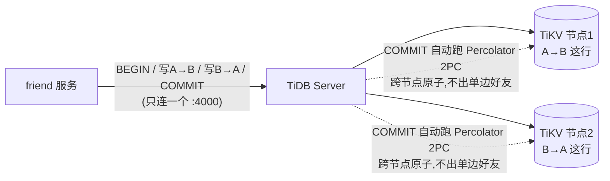

# 好友系统扩展设计:全区全服千万级下的 AcceptRequest 拆解

> 状态:**设计提案,待人拍板**。提出人:Claude(Opus)/ 2026-06-18
> 关联代码:[services/social/friend/internal/data/friend_repo.go](../../services/social/friend/internal/data/friend_repo.go)
> 关联规范:[CLAUDE.md](../../CLAUDE.md) §9 不变量、[AGENTS.md](../../AGENTS.md) §7、[infra.md](./infra.md) §2
>
> 本文**不立即改代码**。当前单 MySQL 实现(2026-06-15)在现阶段正确、够用。本文记录:
> 当好友体量逼近"全区全服、玩家千万、好友边十亿"时,`AcceptRequest` 的跨人强一致事务
> 为什么必须拆,以及推荐的可水平扩展形态。供未来扩容时直接落地。

---

## 1. 背景:现状是单实例 MySQL 本地事务

[friend_repo.go](../../services/social/friend/internal/data/friend_repo.go) 的 `MySQLFriendRepo`
持有一个 `*sql.DB`,连 `pandora_social` **单库**。`AcceptRequest` 在**一个本地事务**里完成:

1. `friend_requests` 行 `FOR UPDATE` 锁 + 确认 `status=pending`;
2. R5 校验 `target == accepter`;
3. 同事务查 `blocks` 双向(防 TOCTOU);
4. `maxFriends>0` 时对双方各 `COUNT(friendships)`;
5. `UPDATE` 请求为 `accepted` + 写双向 `friendships` 边(`INSERT IGNORE`)。

**它成立的唯一前提**:`friend_requests` / `blocks` / `friendships` 三张表的所有相关行
都在**同一个 MySQL 实例**里,`BEGIN…COMMIT` + 行锁才能给出多表多行的原子性 + 隔离性。

---

## 2. 结论先行

| 问题 | 回答 |
|---|---|
| 现在是 MySQL 集群吗? | **不是**。是单实例单库 `pandora_social`,靠它的本地 ACID 事务。 |
| 换 Redis 集群,`AcceptRequest` 这种事务支持吗? | **不支持**。跨 slot/跨节点没有原子事务,见 §3。 |
| 全区全服千万级怎么办? | 必须分片;一旦分片,跨人事务在 **Redis 集群和分片 MySQL 下都不成立**,要拆成"request 单点 CAS + Kafka 异步幂等建边 + 软上限",见 §5。 |

**核心认知**:矛盾不是"MySQL vs Redis",而是"**跨两个玩家的强一致事务 vs 数据分片**"。
换什么存储都绕不开;换 Redis 集群不会让它变可能,换分片 MySQL 一样会碰到。

---

## 3. 为什么 Redis 集群扛不住这个事务

### 3.1 跨 slot 不能原子操作

Redis Cluster 把 key 按 CRC16 散到 16384 个 slot,分布到不同节点。`AcceptRequest` 摸的 key:

```
request:{requestID}        # 请求实体
block:{accepterID}         # accepter 的黑名单
block:{requesterID}        # requester 的黑名单
friends:{requesterID}      # requester 的好友集合
friends:{targetID}         # target 的好友集合
```

不同 `player_id` 几乎必然散到**不同 slot / 不同节点**。Redis 的 `MULTI/EXEC` 和 Lua 脚本
**只能操作同一 slot 的 key**,跨 slot 直接报 `CROSSSLOT keys in request don't hash to the same slot`。

> 想用 `{hashtag}` 把多个 key 强行塞进一个 slot?那等于把这些玩家的数据全绑死在一个节点,
> 千万级下该节点就是热点 + 容量瓶颈,违背分片初衷。不可行。

### 3.2 `MULTI/EXEC` 本来也不是"事务"

即便所有 key 同 slot:Redis 的 `MULTI/EXEC` **没有逻辑回滚**——
某条命令运行期逻辑失败(如校验不通过需中止),前面已执行的命令不会撤销。
`WATCH` 只是**单节点乐观锁**,跨节点无效。所以它给不了 MySQL `FOR UPDATE` 那种
"锁住 + 校验 + 多写 + 失败整体回滚"的语义。

**所以:这段 MySQL 事务不能原样搬到 Redis 集群,原子性与防 TOCTOU 保证都会丢。**

---

## 4. 分片 MySQL 也一样:跨人事务必崩

千万玩家、人均几百好友 → 边十亿级,单 MySQL 容量与写吞吐都不够,**必须按 `player_id` 分库分表**
(对齐 [infra.md](./infra.md) §2.1"按职能分库,后期容易拆服",再往下就是按主键水平分片)。

一旦分片:

- `requester` 与 `target` 的 `friends` 边落在**不同分片**(不同 MySQL 实例);
- 一个本地事务无法跨实例;
- 跨实例强一致只能上 **2PC / XA**——慢、协调者单点、长时间持锁,
  在全服高并发好友接受这种热路径上**不可接受**。

> 这与 §3 的 Redis 跨 slot 是**同一个本质问题**。所以选 Redis 还是分片 MySQL,
> 都得先解决"跨人原子操作没了"这件事。

---

## 5. 推荐形态:request 单点 CAS + Kafka 异步幂等建边 + 软上限

好友请求天然可以**串行化在 `request_id` 这一个实体上**,顺着它拆。这正是 Saga / outbox 模式,
契合 [CLAUDE.md](../../CLAUDE.md) §9 既有不变量(幂等、补偿、kafka key=实体 ID)。

### 5.1 三步拆解

```
┌─ 步骤 1:request 单实体 CAS(强一致,单分片合法) ───────────────┐
│  pending → accepted,条件写:                                     │
│    MySQL: UPDATE friend_requests SET status=accepted             │
│           WHERE request_id=? AND status=pending  (影响行数=1 才算赢)│
│    或 Redis 单 key Lua(request 按 request_id 分片,单 slot 合法) │
│  谁 CAS 成功谁才"接受成功" → 天然幂等、防并发重复 accept          │
│  R5(target==accepter)、block(本地)校验也在这一步同分片内做     │
└──────────────────────────────────────────────────────────────────┘
            │ CAS 成功后,emit 一条事件
            ▼
┌─ 步骤 2:发 Kafka FriendshipEstablished 事件 ─────────────────────┐
│  topic key = 业务实体 ID(对齐 §9.9 同实体有序)                  │
│  payload: {requester_id, target_id, accepted_at, idem_key}       │
│  与 CAS 同分片写 outbox 表,保证"CAS 成功 ⇒ 事件必发"(outbox 模式)│
└──────────────────────────────────────────────────────────────────┘
            │ 消费者按 owner 分片各自落边
            ▼
┌─ 步骤 3:两条边各自单分片幂等写(最终一致) ─────────────────────┐
│  consumer A:在 requester 分片  INSERT IGNORE requester→target    │
│  consumer B:在 target 分片     INSERT IGNORE target→requester    │
│  各自单分片、幂等(INSERT IGNORE / SETNX),失败重试即可          │
│  幂等键 = request_id,对齐 §9.2 幂等 / §9.7 补偿幂等键            │
└──────────────────────────────────────────────────────────────────┘
```

### 5.2 关键设计点

| 项 | 现状(单 MySQL) | 分片形态 |
|---|---|---|
| `pending→accepted` | 事务内 `UPDATE` | **单行条件 CAS**(`WHERE status=pending`,影响行数=1 判赢),单分片合法 |
| 双向建边 | 同事务两条 `INSERT IGNORE` | **拆两条 Kafka 消费**,各自 owner 分片幂等写 |
| block 校验 | 同事务跨人查 `blocks` | block 也按 **owner 分片**存,在各自建边的分片**本地**校验 |
| 好友上限 `maxFriends` | 事务内 `COUNT` 双方,强一致 | **软约束**:见 §5.3 |
| 一致性级别 | 立即一致 | **request 强一致 + 边最终一致**(秒级收敛) |

### 5.3 好友上限只能是"软上限"(必须接受的取舍)

跨分片无法原子 `COUNT` 两个人 → 强一致的"双方同时不超限"在分片下**做不到**。可选:

- **A. owner 本地软校验**:各自建边时在自己分片 `COUNT` 本地好友,超限则**不建该方向边 +
  发补偿事件**回滚另一方向(极少触发);
- **B. 接受软上限**:允许极端并发下略微超过上限若干个,后台对账修正。

> 这是分片架构的**固有取舍**,不是 bug。强一致双边上限与水平扩展不可兼得,
> 产品上把"好友上限"定义为软约束即可(绝大多数玩家远不到上限)。

### 5.4 `Block` 的拆解同理

现在 `Block` 也是单事务(写黑名单 + 删双向边 + 取消 pending)。分片后:
黑名单按 owner 分片本地写;删对方分片的反向边、取消对方分片的 pending,
同样走 **Kafka 事件 + 幂等消费**,最终一致。

---

## 6. 存储选型建议

| 用途 | 建议 |
|---|---|
| 好友图**权威持久层** | **分片 MySQL**(按 `player_id` 分库分表)。十亿级边常驻 Redis 内存成本过高,且 Redis 默认非"权威持久存储"定位。 |
| 热点好友列表**缓存** | **Redis**,只缓存"在线玩家的好友列表"等热数据,主存仍是 MySQL。 |
| `request` 实体 | 按 `request_id` 分片;CAS 在单分片内做(MySQL 单行 或 Redis 单 key Lua 皆可)。 |
| 边分片维度 | 按 **owner(`player_id`)** 分片。现状"双向落两行"的设计**正好支持** `ListFriends` 单分片查,**保留不动**。 |

**不建议**用 Redis 集群当好友图主存(容量 + 持久性 + 跨 slot 限制三重不合适)。

---

## 7. 业界参照:王者荣耀 / LoL 手游这类全区全服好友怎么做

这类产品(注册数亿、DAU 上亿、好友边百亿级)的公开架构惯例,与本文 §5 推荐**同一套思路**,
并补了几个"全服"特有优化。核心铁律:**绝不跨玩家做强一致事务,一切跨人写都拆成单分片幂等写 + 异步补齐**。

### 7.1 典型分层

```
┌─────────────────────────────────────────────┐
│  好友逻辑服(无状态,水平扩)                  │
│  AddFriend / Accept / Block / List            │
└───────────────┬─────────────────────────────┘
     ┌──────────┴──────────┐
     ▼                     ▼
┌─────────────┐    ┌──────────────────┐
│ 在线态/缓存层 │    │ 异步消息(类 Kafka)│
│ Redis 集群   │    │ 双向建边 / 扇出推送 │
│ 按 player 分片│    └────────┬─────────┘
└──────┬──────┘             │
       │              ┌──────▼────────────────┐
       ▼              │ 权威持久层             │
  好友列表热缓存       │ 分库分表 / 自研 KV /    │
  在线状态/红点        │ NewSQL(按 player 分片)│
                      └────────────────────────┘
```

- **权威主存 = 分库分表关系库 / 自研分布式 KV / NewSQL**(腾讯系常见 TDSQL / 自研 KV;边按 `player_id` 哈希分片),**不是把好友图主存放 Redis**。
- **Redis 集群只做热数据**:在线玩家好友列表缓存、在线状态、红点/未读;上线 load、下线淘汰。
- **建边走异步队列**,双向边各自落各自分片,幂等。

### 7.2 两个"全服"特有设计

**(a) 读靠缓存扛,不实时查图**:百亿边规模下打开好友列表不可能每次扫库。
玩家上线时从持久层拉一次好友 ID 列表灌进 Redis(owner 分片一个 key);好友的在线状态 / 段位 /
当前状态(游戏中 / 大厅)去**在线态服务**批量查(`MGET` / 批量 RPC),不是查好友图。
所以"好友列表" = 静态 ID 列表(缓存) + 一批实时状态(在线服务聚合)。

**(b) 在线状态 / 上线提醒 = 扇出(fan-out)问题**:大主播几千好友,上线一次要推几千条。
做法:在线态集中在 **presence 服务**(按 player 分片);上线**不主动推全部好友,改"好友打开列表时拉"
(拉模型)**,或只对"互为好友且都在线"做有限推送;红点 / 提醒走**异步队列 + 离线消息**。

> 这个扇出问题在高峰(登录洪峰 / 大主播)会崩出写放大,专项优化见 **§13 presence 在线状态扇出优化**。

### 7.3 对照 Pandora 现状

| 王者 / LoL 手游做法 | Pandora 现状 | 扩容要补 |
|---|---|---|
| 好友图分库分表(按 player_id) | 单库 `pandora_social` | 加分片路由 / 上 NewSQL |
| 异步双向建边 | 当前同事务建双边 | 拆成 Kafka 双消费(§5) |
| Redis 缓存热好友列表 | 直接查 MySQL | 加在线玩家好友列表缓存 |
| presence 在线态服务 | 已有 `player_locator` + `push` ✅ | 复用、扩容 |
| 异步红点 / 上线提醒 | `pandora.friend.event` → push ✅ | 已是拉 / 推混合雏形 |

> Pandora 的 `player_locator`(在线态) + `push`(扇出推送) + `pandora.friend.event`(异步事件)
> 三件套,**正是王者那套 presence + fan-out + 异步建边的雏形,方向没跑偏**。

---

## 8. TiDB 能不能用

**能,而且是几个方案里"代码改动最小"的一条**。TiDB 是 NewSQL / 分布式数据库,
与 Redis 集群、手工分库分表有本质区别。

### 8.1 能力对比

| 能力 | Redis 集群 | 手工分库分表 MySQL | **TiDB** |
|---|---|---|---|
| 跨分片**分布式 ACID 事务** | ❌ 跨 slot 不行 | ❌ 要 2PC/XA,难用 | ✅ **原生支持**(Percolator 2PC) |
| `FOR UPDATE` 悲观锁 | ❌ | ✅ 仅单分片内 | ✅ **跨节点也支持**(悲观事务) |
| MySQL 协议兼容 | ❌ | ✅ | ✅ **基本兼容** |
| 自动分片(无需应用层路由) | 手动 hashtag | ❌ 手动 | ✅ **自动 Region 切分** |

**关键卖点**:用 TiDB,本文档批判的"跨人事务在分片下不成立"**不再成立**——
`AcceptRequest` 的 `BEGIN / FOR UPDATE / 多表写 / COMMIT` TiDB 都能跨节点跑,**强一致保住、代码几乎不改**。

### 8.2 三个必须知道的代价(不是银弹)

1. **跨节点事务 = 分布式 2PC,热路径有延迟代价**。`requester` / `target` 落不同 TiKV 节点时,
   COMMIT 走 Percolator 两阶段提交,比单机本地事务多一轮网络(Prewrite + Commit)。
   好友接受是热路径,高 QPS 下这个开销会显现。
2. **热点写 / 单调主键热点**。雪花 `request_id` 单调递增会集中写同一个 Region → 热点。
   需 `SHARD_ROW_ID_BITS` / `AUTO_RANDOM` 或打散主键缓解。Pandora 用雪花 ID,**这点必须注意**。
3. **运维 + 成本重**。一套要跑 PD + TiKV(Raft 三副本)+ TiDB Server(+ TiFlash),
   最小生产集群好几个节点,存储放大;比单 MySQL 重一个量级。

### 8.3 为什么王者自己不一定用 TiDB

腾讯系更多用 **TDSQL / 自研分布式 KV**,且好友建边**仍倾向异步双向建边**而非依赖分布式事务硬扛。
原因:百亿边、极高 QPS 下,**能用"单分片幂等写 + 异步补齐"避开的跨节点事务就尽量避开**,
2PC 再快也是成本。TiDB 的分布式事务是"方便",不是"免费"。

### 8.4 给 Pandora 的分阶段建议

```
阶段 1(现在)        单 MySQL 本地事务         ← 当前位置,正确
阶段 2(千万级早期)   TiDB,代码几乎不改        ← 性价比最高的过渡,保强一致
阶段 3(极限体量)    TiDB / 分片库 + 热路径     ← request CAS + Kafka 异步建边(§5),
                     改异步建边,卸掉 2PC        把跨节点事务压力卸掉
```

> **TiDB 是阶段 2 的最优解**:最小代码改动换水平扩展 + 保留强一致;
> 真到极限规模再把热路径跨人事务拆异步,卸掉 TiDB 的 2PC 压力。

### 8.5 核心场景:好友 A 与 B 落在不同节点,事务为什么仍原子

这是好友功能分布式化最容易出错的点,单独讲清。接受好友请求要在**一个事务里写双向边**
([friend_repo.go](../../services/social/friend/internal/data/friend_repo.go) `AcceptRequest`):

```go
const insFriend = `INSERT IGNORE INTO friendships (player_id, friend_id) VALUES (?, ?)`
tx.ExecContext(ctx, insFriend, requesterID, targetID) // A→B 这行
tx.ExecContext(ctx, insFriend, targetID, requesterID) // B→A 这行
```

按 `player_id` 分布时,`A→B` 与 `B→A` 两行**物理上会落在不同 TiKV 节点**。

- **分库分表 MySQL(否决)**:两台独立 MySQL 各自只有本地事务,一个 `BEGIN...COMMIT`
  无法原子覆盖两台机器。硬上 XA/2PC 自行编排极易出现"A 那行写了、B 那行失败"→
  **单边好友**(A 看到 B,B 看不到 A),违反数据一致性。这就是 §4 "跨人事务必崩"。
- **TiDB(采用)**:friend 服务**只连一个 SQL 入口 `:4000`**,以为在用普通 MySQL。
  `COMMIT` 那一刻,TiDB 自动对涉及的 TiKV 节点跑 **Percolator 2PC**:
  **两行要么都提交、要么都回滚**,绝不产生单边好友。`SELECT...FOR UPDATE` 锁请求行、
  `maxFriends` 上限校验跨节点同样生效。**业务代码一行都不用改**——这就是选 TiDB 而非
  分库分表的全部理由。



**自验**(集群起好后):

```pwsh
# 看 friendships 表数据切成哪些 region(生产多 TiKV 时分摊到不同节点)
docker run --rm --network pandora-tidb-net mysql:8.4 `
  mysql -h tidb -P 4000 -u root -e "SHOW TABLE pandora_social.friendships REGIONS;"
```

**代价**(§8.2 第 1 条):A、B 真在不同节点时,COMMIT 多一轮跨节点网络(Prewrite+Commit)。
好友接受是热路径,极高 QPS 下延迟显现 → 阶段 3 再按 §5 拆异步建边卸掉 2PC,**现在不需要**。

---

## 9. 概念澳清:分片 / 节点 / 分布式事务,以及读 vs 写

这三个概念极易绕混,先说清。

### 9.1 三个词的关系

| 词 | 是什么 | 谁决定 |
|---|---|---|
| **分片(sharding)** | 把数据按规则切开放到不同地方(如 player_id 哈希分两台) | 你 / 中间件 |
| **节点(node)** | 一台实际存数据的机器 | 物理部署 |
| **分布式事务** | 一个事务**跨多个节点**还能保 ACID | 数据库引擎 |

> **因果链**:数据分片 → 数据进了多节点 → 才产生"跨节点"问题 → 才需要分布式事务。
> **不分片(单 MySQL)就没有跨节点问题,普通本地事务就够。**

所以不是"分布式事务需要分片",而是**先有分片(数据进多节点),跨节点的写才需要分布式事务来兑底**。

### 9.2 读(取好友)几乎不跨节点——不是问题

关键在现有数据模型(双向落两行,按 owner 分片):

```
ListFriends(A) = 查 "owner=A 的所有边"  → 全在 A 所在节点,单节点搞定
ListFriends(B) = 查 "owner=B 的所有边"  → 全在 B 所在节点,单节点搞定
```

**即使 A、B 在不同节点,取 A 的好友列表也只摸 A 这一片,根本不跨节点**。
这就是为什么反复强调"双向落两行的设计对分片友好,保留不动"。

> 什么时候读才跨节点?只有"一次要读两个人的数据"(如判断 A、B 是否好友 + 同时看 B 在不在线)。
> 但这种**也不需要事务**——分别去两个节点查一下、各自返回即可(两次查询,不要求原子)。
> **读从不需要强一致事务,顶多多一次网络往返。**

### 9.3 真正的难点只在"写"(同时写两个节点要不要原子)

`AcceptRequest` 要**同时**做两件写:

```
在 A 的节点:写 A→B 这条边
在 B 的节点:写 B→A 这条边     ← A、B 不同节点
```

问题:这两条边要不要"要么都成功、要么都失败"?中途宕机只写了 A→B → A 看 B 是好友、
B 看 A 不是 → **单向好友,数据不一致**。这才是跨节点写的难点,两条路解:

- **路 A(TiDB)**:照常 `BEGIN; 写A→B; 写B→A; COMMIT;`,引擎用 2PC 保证两节点原子,代码跟单机一样。
- **路 B(§5)**:先写 A→B(算 accept 成功),发 Kafka 让 B 节点**异步**补 B→A,没补上就重试(幂等)。

### 9.4 一张图串起来

```
                     A、B 在不同节点
        ┌─────────────────┼────────────────┐
        ▼                 ▼                 ▼
   读 A 的好友        读 B 的好友        同时写 A、B 两条边
   (只查 A 节点)     (只查 B 节点)      (跨两个节点)
     ✅ 没问题         ✅ 没问题        ⚠️ 这里才是难点:要不要原子?
                                       ├ TiDB:引擎用 2PC 帮你原子
                                       └ §5:不原子,异步补 + 最终一致
```

**一句话**:读从来不是问题(按 owner 分片,查谁去谁那一片);问题只在"同时写两个不同节点的边要不要原子"。

---

## 10. 修正:"软上限"不是绝对必须,是**有条件的取舍轴**

本文 §5.3 说"强一致双边上限在分片下做不到",**这句话要加前提**:它只在"分片 + 异步建边、不走分布式事务"那条路下成立。
它**不是物理定律,是架构选择的结果**。

| 选的路 | 双边上限能强一致吗 | 代价 |
|---|---|---|
| 分片 + 异步建边(§5) | ❌ 只能软上限 | 换来:快、便宜、最终一致 |
| 分布式事务 DB(TiDB / CockroachDB / FoundationDB) | ✅ 能强一致 | 换来:热路径 2PC 延迟 + 运维成本 |

**本质是 CAP / PACELC**:要么放弃强一致(软上限),要么花 2PC 的延迟和成本买强一致。
之前默认走 §5 才说"必须接受",愿意付 2PC 成本就不必接受。

> **务实判断**:即便能强一致,大厂大多仍选软上限。因为"好友上限"是低价值不变量——
> 为一个玩家几乎碰不到的精确上限,在每次 accept 都付跨节点 2PC,通常不划算。
> 所以选软上限是**性价比判断**,不是"被迫"。

---

## 11. 候选开源库对比(让分布式好友事务变简单)

分两类,看你想保留哪种写法。

### 11.1 (A) 保留"事务式写法"——分布式 ACID 数据库

| 库(GitHub) | 协议 | 跨分片 ACID | License | 备注 |
|---|---|---|---|---|
| **pingcap/tidb** | MySQL | ✅ Percolator 2PC | Apache 2.0 | 现有 MySQL 代码**几乎零改**,§8 已评 |
| **cockroachdb/cockroach** | PostgreSQL | ✅ 默认 Serializable | ⚠️ BSL(非纯开源,商用受限) | 能力强,License 要注意 |
| **yugabyte/yugabyte-db** | PostgreSQL | ✅ 分布式 ACID | Apache 2.0(干净) | Postgres 兼容,协议比 Cockroach 干净 |
| **apple/foundationdb** | KV(自建层) | ✅ 严格可串行化(最强) | Apache 2.0 | 多键跨片 ACID 最干净,但是 KV 要自建数据模型层;有事务 5s/10MB 限 |

最省事还是 **TiDB**(MySQL 协议,改动最小);要最强一致语义可看 FoundationDB,但要自己写存储层。

### 11.2 (B) 走异步 Saga / 补偿但不想手写——分布式事务编排框架

**⭐ dtm-labs/dtm**(Go 原生,最契合 Pandora 的 Go + Kafka 栈):

- 支持 **Saga / TCC / 二阶段消息 / XA**,自带**子事务屏障**(防空补偿、防悬挂、幂等)、自动重试、补偿编排。
- 正好把 §5 那套"CAS + 双向建边 + 失败补偿"的脏活累活兜底——不用自己手写幂等键管理、补偿回滚、消息重投去重。
- 它**不替代存储**,是在你 MySQL/Redis/Kafka **之上**做编排。可"单 MySQL / 分片库 + dtm 编排"组合。

> Java 栈才看 seata;你是 Go,**dtm 是直接对口的那个**。

### 11.3 (C) 好友图"读"侧(百亿边社交图)

- **vesoft-inc/nebula(NebulaGraph)**:专为十亿~百亿边社交图设计,适合"共同好友、二度关系、推荐"。
  但它**不给强跨节点 ACID**,只当读 / 分析层,写一致性还得靠 A/B 方案。

### 11.4 选型速查

```
想最省事 + 保强一致(含双边上限) → TiDB(代码几乎不改)
想走异步 Saga 但少踩坑           → 单库/分片库 + dtm 编排(Go 对口)
极限读性能(社交图查询)          → 叠 NebulaGraph 做读层
```

---

## 12. 2PC 延迟与运维成本详解

上面反复说 TiDB 的代价是"2PC 延迟 + 运维成本",这里拆开讲透。

### 12.1 2PC(两阶段提交)到底多做了什么

单机 MySQL 本地事务提交 = **1 次**本地写 redo/binlog + fsync,几乎无网络。
跨节点事务(TiDB Percolator)COMMIT 要走两阶段,多出成主要来自网络往返和多节点 fsync:

```
客户端
  │  ① Prewrite(预写):给所有参与节点上锁 + 写数据(未提交)
  │     └→ 需等所有参与节点 ACK(跨节点 RTT × 1 轮)
  │        每个节点还要 Raft 三副本达成多数派(再一轮副本间 RTT)
  │  ② Commit(提交 primary key):再一轮网络写 + Raft
  │     └→ 返回客户端成功(secondary key 可异步清理)
  ▼
```

关键:**一次跨节点事务至少 2 轮跨节点网络 RTT,且每轮内还叠一次 Raft 多数派 fsync**。
对比单机本地事务的"几乎 0 网络",这就是多出来的延迟。

### 12.2 延迟量级感(量级,非承诺值)

| 场景 | 单次写提交典型延迟 | 说明 |
|---|---|---|
| 单机 MySQL 本地事务 | 亚毫秒~几毫秒 | 本地 fsync 为主 |
| TiDB 事务,**同机房**跨节点 | 几毫秒~十几毫秒 | +Prewrite/Commit 两轮 + Raft |
| TiDB 事务,**跨可用区 / 跨城** | 几十毫秒 起 | 跨城 RTT 动辄 ≥10ms×多轮,**好友热路径不可接受** |

> 结论:TiDB 要想热路径可用,**节点尽量同机房 / 同可用区**;跨城部署的跨区事务延迟会把好友 accept 拖慢。
> 这也是为什么§5 异步建边在**跨城 / 极高 QPS** 场景反而更稳——它把同步 2PC 换成了异步单分片写。

### 12.3 2PC 还有两个"隐形"代价(不只是延迟)

1. **锁占用变长**:Prewrite 到 Commit 期间参与行被锁。跨节点窗口比单机长,
   热点行(如同一大 V 被大量人加好友)上锁冲突 / 重试会放大。
2. **失败面变大**:参与节点越多,某节点慢 / 抖 / GC 就拖整个事务;还有 TiDB 的
   `tikv_gc_life_time` / 事务超时 / `write conflict` 重试等新故障模式要监控。

### 12.4 运维成本:单 MySQL vs TiDB 到底重在哪

| 项 | 单 MySQL | TiDB 集群 |
|---|---|---|
| 组件种类 | 1 个 mysqld | **PD(≥3)+ TiKV(≥3)+ TiDB Server(≥2)**(+ TiFlash 可选) |
| 最小生产节点数 | 1(+1 从库) | **≥7 个进程 / 节点起步** |
| 存储放大 | 1×(+从库) | **3×**(TiKV Raft 三副本) |
| 升级 / 扩容 | 会停机 / 主从切 | 滞动扩容(优),但**有 PD 调度 / Region 迁移 / 热点调度要懂** |
| 监控面 | 熟悉 | 多了 PD/TiKV/Region/热点/GC 一整套指标,**运维学习曲线陡** |
| DBA 要求 | 低 | **需懂分布式存储 / Raft / 调度**,人才成本高 |
| 机器成本 | 低 | 高(3× 存储 + 更多节点 + 推荐 SSD/NVMe) |

> 一句话:**TiDB 把"应用层的分布式复杂度"搬进了"数据库运维"**。代码变简单了,但你多了
> 一个需要专人懂的分布式数据库集群。对 Pandora 这种团队,要提前衡量运维人力。

### 12.5 怎么把 2PC 代价压到最小(如果走 TiDB)

- **节点同机房 / 同可用区**,别跨城贑热路径事务;
- **热点打散**:`AUTO_RANDOM` / `SHARD_ROW_ID_BITS` 治雪花 ID 单调递增热点(§8.2);
- **表结构尽量让一事务落少节点**:双向边按 owner 分片不可避免跨节点,但别再衔进无关表的跨片写;
- **能异步就异步**:不要求强一致的部分(如建边后发提醒)走 Kafka,只把真需原子的圈进事务。

---

## 13. presence 在线状态扇出优化(好友上下线同步)

承 §7.2(b)。"好友上线通知所有在线好友"是社交系统最经典的 **presence fan-out** 难题,
与§5 好友建边的处理思路恰好相反。

### 13.1 难点:写放大 + 高频抖动

- **写放大(fan-out amplification)**:人均 200 好友 → 上线一次最多推 200 条;
  10 万人同时段登录高峰 → 瞬间 2000 万条推送;大主播几千好友,一次上线就是几千扇出。
- **高频抖动(state flapping)**:切前后台 / 断线重连 / 地铁网络抖 → 几秒内反复上下线,
  每次都全量扇出 → **绝大多数是无效推送**。
- **N×M 爆炸**:好友越多越活跃(核心用户)推送越贵。

> 核心认识:在线状态是**高频、低价值、可容忽延迟、可容丢失**的数据——绝不能用好友接受那种强一致严肃路径去做。

### 13.2 第一原则:拉 vs 推,优先用"拉"

| 模型 | 做法 | 代价 |
|---|---|---|
| **推(fan-out on write)** | 上线即推给所有在线好友 | 写放大,主播灾难 |
| **拉(fan-out on read)** | 谁打开好友列表,才去批量查好友在线态 | 几乎零扇出,列表页有查询 |

**默认用"拉"**:玩家打开好友面板那一刻,拿好友 ID 列表去 presence 服务**批量查**(一次 `MGET` / 批量 RPC 查 200 个),
而不是平时不停推。同一时刻真正盯着好友列表看的人很少,这一步直接把 2000 万扇出干掉绝大部分。

### 13.3 presence 服务设计(player_locator 演进)

- **状态存 Redis 按 player_id 分片**:`presence:{player_id} → {status, server, heartbeat_ts}`,带 TTL(30~60s)。
- **TTL 过期 = 自动判离线**:客户端 / DS 周期心跳续 TTL;不靠可靠的"下线事件"
  (下线往往是断网,根本发不出事件)。这招把最不可靠的"下线通知"消掉。
- **查询走批量**:presence 服务加 `BatchGetPresence([]player_id)` 一个接口,
  好友列表页 = 拉一次好友 ID(缓存) + 一次批量 presence,**两次查询搞定,零扇出**。

### 13.4 必须推时(面板正开着要实时变绿)怎么压

叠加使用:

1. **只推给"订阅者"**:玩家打开好友面板 → 订阅这批好友的 presence 变更;关闭面板 → 取消订阅。
   上线事件**只推给"此刻正盯着你这一行看的人"**(通常 0~几个)——**扇出从 N 降到个位数**。
2. **去抖(debounce)**:上线后延迟 5~10s 再广播,期间又下线就不推(判为抖动);
   下线给宽限,避免闪断也推。抖动玩家对外表现为状态稳定,无效推送被吸收。
3. **合并(coalesce)**:presence 变更不逐条推,按目标玩家聚合,1s 内攒一批合成一条
   "你的好友 A/C/F 上线了"批量推。对登录洪峰特别有效。
4. **状态降采样 / 分级**:只同步粗粒度状态(在线/离线/游戏中),不同步血量/地图等高频细节;
   细节等玩家点进详情再单独拉。

### 13.5 登录洪峰(开服 / 维护后)专项

- **错峰 / 抖动窗口**:登录后不立即广播,统一进 13.4 延迟窗口,洪峰被摊平;
- **冷启动用拉不用推**:洪峰期直接关主动推,全量走"打开列表才拉",洪峰过了再恢复订阅推;
- **限流 + 降级开关**:presence 扇出挂 killswitch(项目有 `pkg/killswitch`),压力超阈值自动降为"纯拉模式",保主链路。

### 13.6 落到 Pandora(复用现成件)

```
                    ┌──────────────────────────────┐
                    │ presence 服务(player_locator   │
                    │ 演进)按 player_id 分片          │
                    │ Redis: presence:{pid} +TTL     │
                    └───────┬───────────────┬────────┘
              心跳续TTL      │               │ 批量查(拉,默认)
        DS/客户端 ─────────┘               ▼
                                    好友面板打开 → BatchGetPresence(好友ID[])
                                            │
        好友面板"正打开"才订阅 ──────────────┘
              │ 变更事件(去抖+合并后)
              ▼
        pandora.friend.event ──→ push 服务(已有)──→ 客户端那一行变绿
```

| 优化 | 复用 Pandora 现成件 |
|---|---|
| presence 存储 + TTL 判离线 | `player_locator` + Redis(§9.10 TTL≤30s 正好) |
| 变更事件异步 | `pandora.friend.event` Kafka(已有) |
| 推送通道 | `push` 服务(已有) |
| 洪峰降级 | `pkg/killswitch`(已有) |
| 批量查 | presence 服务加 `BatchGetPresence` 一个接口 |

**几乎不用新基建**——主要是给 `player_locator` 加 presence 语义 + 批量查 + 订阅/去抖/合并逻辑。

### 13.7 优化顺序(按性价比)

```
1. 默认拉模型(打开列表才批量查)        ← 最大收益,先做这个
2. TTL 判离线(消灭不可靠的下线事件)    ← 简单且关键
3. 必须推时:只推订阅者(开着面板的人)   ← 把 N 降到个位数
4. 去抖 + 合并(吸收抖动 + 摊平洪峰)     ← 压掉无效/峰值流量
5. killswitch 降级为纯拉(保命)         ← 兑底
```

> 核心思想:在线状态是"高频低价值可丢失"数据,**能拉就不推、能不推就不推、必须推就去抖+合并+只推订阅者**。
> 跟好友建边那种"低频高价值强一致"的处理思路正好相反。

---

## 14. 迁移成本与触发条件

### 14.1 什么时候才需要做

**现在不需要**。单 MySQL 在当前体量下:实现简单、强一致、零分布式复杂度,是正确选择。
触发扩容的信号(任一即评估):

- `pandora_social` 单库写 QPS / 连接数逼近实例上限;
- `friendships` 表行数 → 亿级,单表索引 / 备份 / DDL 变痛;
- 明确进入"全区全服合服、目标玩家千万"阶段。

### 14.2 迁移成本(诚实评估)

- 引入分片中间件(或应用层分片路由)+ 数据迁移(在线双写 / 灰度);
- `AcceptRequest` / `Block` 从"本地事务"重写为"CAS + outbox + Kafka 消费",**测试面变大**
  (并发 accept、消息重投、补偿回滚都要覆盖);
- `maxFriends` 语义从硬上限改软上限,需产品确认;
- 接口契约可保持不变([FriendRepo](../../services/social/friend/internal/data/friend_repo.go) 抽象不变),
  换实现 `ShardedFriendRepo`,`AcceptRequest` 返回值语义(`accepted bool`)天然兼容
  "本次 CAS 是否赢"——**现有接口设计对分片友好,这点是加分项**。

### 14.3 不变量对照(迁移后仍须满足 CLAUDE.md §9)

- §9.2 幂等:建边 `INSERT IGNORE` + 幂等键 `request_id` ✅
- §9.7 补偿幂等键:超限 / block 回滚走补偿事件 ✅
- §9.8 写带 trace_id ✅
- §9.9 kafka key = 业务实体 ID ✅
- §9.10 Redis lock TTL ≤ 30s(若用 Redis CAS 加锁) ✅

---

## 15. 待拍板

> **2026-06-18 已拍板:扩容存储路线选 (A) TiDB**。详见下方"拍板结论"。

- [x] 认可"现阶段保持单 MySQL,不提前分片"(避免过度工程)。
- [x] 认可未来扩容形态 = **request 单点 CAS + Kafka 异步幂等建边 + 软上限**(本文 §5);**仅作为阶段 3(极限体量)的热路径卸压方案**,非阶段 2 默认形态。
- [x] 认可 `maxFriends` 在分片后降级为**软约束**(但注意 §10:软上限只在 §5 路必须;**走 TiDB 阶段 2 仍保硬约束 + 强一致**)。
- [x] 扩容存储路线:**选 (A) TiDB 过渡(§8,代码改动最小,保强一致)**。否决 (B) 分片 MySQL + dtm、(C) 其他分布式 ACID 库(留作 §11.1 备选)。
- [x] 认可主存用 **TiDB**,Redis 仅作热点缓存(不当好友图主存)。

### 拍板结论(2026-06-18)

- **选 (A) TiDB**。理由:阶段 2(千万级早期)代码改动最小——`AcceptRequest` 的
  `BEGIN / FOR UPDATE / 多表写 / COMMIT` 在 TiDB 跨节点原生可跑,**强一致与硬上限语义都保留**
  (§8.1 / §8.4),不必为提前分片重写成 CAS + Kafka 异步建边。
- **保留逃生通道**:真到阶段 3 极限体量、TiDB 2PC 热路径成本显现时,再把好友接受热路径拆成
  §5 的"单点 CAS + Kafka 异步幂等建边",卸掉跨节点事务(§8.4 阶段 3)。
- **必须注意的 TiDB 代价**(§8.2):雪花 `request_id` 单调主键热点需 `AUTO_RANDOM` /
  `SHARD_ROW_ID_BITS` 打散;跨节点 2PC 热路径延迟;PD + TiKV + TiDB Server 运维成本重一个量级。
- (B)/(C) 否决理由:(B) 分片 MySQL + dtm 需把本地事务重写为编排 saga,测试面与运维复杂度更高且不保跨人强一致;
  (C) 其他分布式 ACID 库(Yugabyte/Cockroach 等,§11.1)与 MySQL 协议兼容性、生态成熟度不及 TiDB,留作备选不首选。

### 落地修订(2026-06-18,人工拍板覆盖"不提前引入")

> 原拍板第三条"不立即落地、保持单 MySQL"被人工决策**主动推翻**:确认现在就把
> friend(及同库 chat)切到 TiDB。决策人 = 人(AGENTS.md §11.1 人负责架构决策)。

已落地(项目内,Claude):

- TiDB 版 `pandora_social` DDL(含 §8.2 热点处理):[deploy/tidb-init/01-social-tidb.sql](../../deploy/tidb-init/01-social-tidb.sql)。
  - `friendships` / `blocks` 代理主键 `id` → `AUTO_RANDOM`(打散写热点;Go 不读 id);
  - `friend_requests` / `chat_private_messages` 雪花显式主键 → `NONCLUSTERED PK +
    SHARD_ROW_ID_BITS=4 + PRE_SPLIT_REGIONS=4`(雪花是业务 ID 不变量 §9.11 不能改,
    改行 ID 随机分片避时间序写热点)。
- friend 服务 TiDB 连接配置:[services/social/friend/etc/friend-dev-tidb.yaml](../../services/social/friend/etc/friend-dev-tidb.yaml)
  (仅 DSN 指向 TiDB :4000,其余同 friend-dev.yaml)。
- **Go 业务代码零改动**:TiDB 兼容 MySQL 协议,`pkg/mysqlx` + `database/sql` 直连;
  [friend_repo.go](../../services/social/friend/internal/data/friend_repo.go) 的事务 /
  `FOR UPDATE` / `INSERT IGNORE` 不变。

待办(环境,Codex / 人,§11.1):起 TiDB 集群(PD+TiKV+TiDB Server)/ 拉镜像 / 装载 DDL /
单 MySQL→TiDB 数据迁移(Dumpling+Lightning)。交接见
[deploy/tidb-init/README.md](../../deploy/tidb-init/README.md)。

已同步:[pandora-arch.md](./pandora-arch.md) §11 决策行 + [PROGRESS.md](../../PROGRESS.md)。
