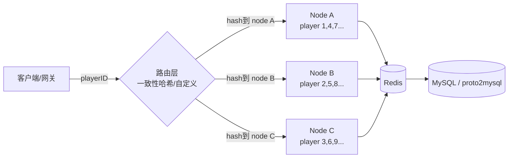
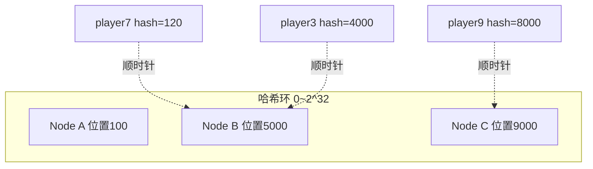
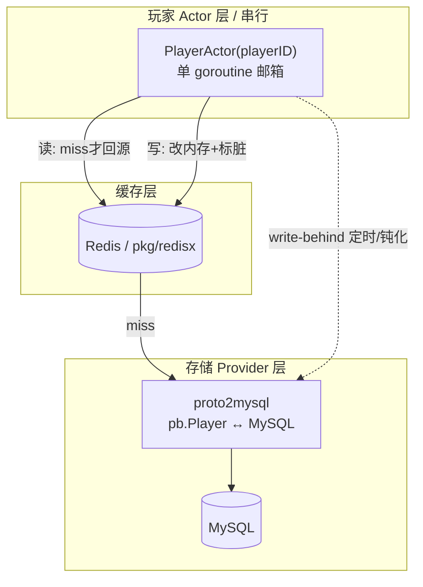

# 玩家数据存取设计:单玩家串行 + 水平扩展 + Redis→MySQL 落库

> 状态:**技术选型讨论纪要 / 设计提案,待落地**。整理人:GitHub Copilot / 2026-06-22
> 关联代码:[pkg/redisx](../../pkg/redisx)、[services/data](../../services/data)、[proto/](../../proto)
> 关联仓库:[proto2mysql](https://github.com/luyuancpp/proto2mysql)(底层落库库,已选定)
>
> 本文记录一次关于"如何让某个玩家的 Redis→MySQL 存取串行,同时仍能水平扩展"的
> 完整讨论与结论,供后续在 `XuanMing-Server` 落地玩家数据服务时直接参考。

---

## 0. 需求回顾

最初诉求:

1. 针对**某一个玩家**,对其数据的 Redis ↔ MySQL 存取要**串行**(避免并发竞争)。
2. 落库环节用自己指定的 [proto2mysql](https://github.com/luyuancpp/proto2mysql) 插件。
3. 还要能**平衡扩展 / 水平扩展**。
4. 路由 hash 希望**可以自定义**,例如按玩家的 `zone id` 落到不同节点。

结论先行:这套需求本质是 **Actor 模型 / 单写者(single-writer)模式**。
纯 Go 技术栈下可自洽实现为:
**`Actor(串行 + 路由) + Redis(缓存) + proto2mysql(落库)`**,无需引入 C#/Orleans。

---

## 1. 核心模式:Actor / 单写者

"某个玩家的存取串行"本质就是 Actor 模型:每个玩家是一个独立 Actor,
所有对它的读写都进入一个**邮箱(mailbox)队列**,由**单个 goroutine 串行处理**,
从而天然避免并发竞争,业务代码内**无需加锁**。

最小骨架(自写版):

```go
// 每个玩家一个 goroutine + channel 邮箱,按 playerID 路由分片
type playerActor struct {
    id    int64
    state *PlayerData    // 内存态,从 Redis/MySQL 加载
    mbox  chan func()    // 所有操作串行进这里
    dirty bool
}

func (a *playerActor) loop() {
    for fn := range a.mbox { // 单 goroutine 串行执行 → 天然无锁
        fn()
    }
}
```

- **读**:激活时 Redis miss → 走 proto2mysql 回源 → 回填 Redis。
- **写**:改内存 + 标记 dirty + 写 Redis;MySQL 用 **write-behind**(定时/脏标记批量落库)。
- **分片**:同一玩家永远落在同一队列 → 串行成立。

### 现成框架选项

| 框架 | 语言 | 说明 |
|------|------|------|
| [protoactor-go](https://github.com/asynkron/protoactor-go) | Go | 主流。Virtual Actor,自带 persistence,存储可插拔 → 可接 proto2mysql |
| [ergo](https://github.com/ergo-services/ergo) | Go | Erlang/OTP 风格,gen_server 天然串行 |
| [Microsoft Orleans](https://github.com/dotnet/orleans) | C# | Virtual Actor 鼻祖,设计最完善(但非 Go 栈) |
| [GoWorld](https://github.com/xiaonanln/goworld) | Go | 游戏框架,实体常驻内存、串行访问、Storage 可换 |
| [Pitaya](https://github.com/topfreegames/pitaya) | Go | 分布式游戏框架,持久化需自接 |

---

## 2. 串行与扩展的矛盾,以及解法

**核心矛盾**:串行要求"同一玩家永远只在一个地方处理";
扩展要求"能把玩家分散到多台机器"。

**解法**:玩家是**路由单位**,不是机器。只要保证同一个 `playerID`
始终路由到同一节点的同一队列:

- 单玩家视角:全程串行 ✅
- 集群视角:不同玩家分散在 N 台机器 → 水平扩展 ✅



---

## 3. 路由方案对比

| 方案 | 扩展性 | 重平衡(加/减机器) | 适合 |
|------|--------|------------------|------|
| **取模分片** `playerID % N` | 差 | N 变化时几乎全部玩家要迁移 | 节点数固定 |
| **一致性哈希** | 好 | 只迁移约 `1/N` 玩家 | 节点动态增减 |
| **Virtual Actor**(protoactor/Orleans) | 最好 | 框架自动迁移、自动激活/钝化 | 弹性伸缩 |

### 一致性哈希(Consistent Hashing)

把节点和 key 都映射到一个**环(0 ~ 2³²)**,key 顺时针找到的第一个节点即归属。

- **加机器**:只迁移"新节点到上一个节点之间"那段 key(约 `1/N`),其余玩家不动。
- **虚拟节点(vnode)**:每个物理节点在环上放数百个虚拟点,分布更均匀、避免倾斜。
- 这是**水平扩展的关键**:加机器只迁移少量玩家,服务基本不抖动。



### Virtual Actor 路由

= 一致性哈希路由 + 自动激活/钝化 + 自动迁移,框架封装好:

| 你只管 | 框架自动做 |
|--------|-----------|
| `cluster.Get("player/123")` 拿到玩家 Actor | 一致性哈希算出该玩家在哪个节点 |
| 发消息给它 | 节点上没有就**自动激活**(从 Redis/MySQL 加载) |
| 不关心它在哪台机器 | 空闲时**自动钝化**(落库卸载) |
| | 加/减节点时**自动 rebalance + 交接** |

---

## 4. 自定义 hash / 按 zone id 路由

**路由可以完全自己写**,框架的一致性哈希只是默认策略。路由本质是一个函数:

```
node = route(key)   // key 和映射规则都可自定义
```

按 zone id 落节点叫**分区键路由(partition key routing)**:

```go
// 方式 A:zone 直接绑定节点(静态分区)
func route(p Player) NodeID {
    return zoneToNode[p.ZoneID]            // zone1,2→A;zone3,4→B
}

// 方式 B:zone 内部再做一致性哈希(两级路由,推荐)
func route(p Player) NodeID {
    nodes := nodesOfZone(p.ZoneID)         // 先按 zone 圈定一组节点
    return consistentHash(nodes, p.ID)     // 组内再按 playerID 均衡
}
```

**两级路由(方式 B)最实用**:

- **第一级 zone(亲和性)**:同区玩家落在同一组机器 → 同区交互(组队/PVP/聊天)
  是本地调用,跨机 RPC 少、延迟低。
- **第二级一致性哈希(均衡)**:区内按 playerID 打散 → 区内也能多机扩展 + 单玩家串行。

### 必须守住的不变量

1. **确定性**:路由表不变时,同一 `playerID` 永远算出同一节点 → 串行成立。
2. **路由表一致**:所有节点/网关看到的"zone→节点"映射必须一致
   (放 etcd/Consul,变更时广播)。
3. **迁移交接**:zone/节点重分配时,旧节点先"**停写+落库**",新节点再激活 →
   避免双写破坏串行(下方"坑"展开)。

---

## 5. 平衡/迁移时的两个坑

1. **迁移时的串行安全**:玩家从 Node A 迁到 Node B 的瞬间,必须先在 A 上
   "停写+落库",B 才能激活,否则会出现**双写**破坏串行。
   Virtual Actor 框架内部有 handover 协议处理;自写分片需自己实现"交接锁"。
2. **热点玩家**:一致性哈希通常分布均匀,但若某玩家是超级热点(如大主播),
   单 Actor 串行可能成瓶颈 → 需把该玩家的不同子状态拆成多个 Actor。

---

## 6. 落库层:proto2mysql(已选定)

仓库:<https://github.com/luyuancpp/proto2mysql> —— 纯 Go,把 Protobuf message ↔
MySQL 表自动映射,提供 CRUD,无需手写 SQL。

| 特性 | 对本方案的意义 |
|------|---------------|
| **100% Go** | 与 `XuanMing-Server` 同栈,**无需引入 C#/Orleans** |
| Protobuf 驱动 | `proto/` 已有 pb 定义,玩家数据用 pb 表示,落库零转换 |
| 参数化查询 | 防 SQL 注入,安全 |
| `InsertOnDupUpdate` / `Save`(REPLACE) | **write-behind 落库的理想接口**(整条 upsert) |
| `FindOneByKV` / `FindOneByWhereWithArgs` | 激活时回源加载玩家 |
| 内部读写锁、批量插入(默认 1000/批) | 批量落库脏玩家 |

### 核心 API 速查

- 表结构:`CreateOrUpdateTable`、`UpdateTableField`、`IsTableExists`
- 插入:`Insert`、`BatchInsert`、`InsertOnDupUpdate`、`Save`(REPLACE)
- 查询:`FindOneByKV`、`FindOneByWhereWithArgs`、`FindAll`、`FindAllByWhereWithArgs`
- 更新:`Update`(按主键)
- 删除:`Delete`(按主键)
- 配置:`WithPrimaryKey`、`WithIndexes`、`WithUniqueKey`、`WithAutoIncrementKey`、`WithNullableFields`

### 类型映射(节选)

| proto 类型 | MySQL 类型 |
|-----------|-----------|
| int32 / uint32 | int / int unsigned |
| int64 / uint64 | bigint / bigint unsigned |
| string | MEDIUMTEXT |
| bytes / message / map / repeated | MEDIUMBLOB(序列化存储) |
| enum | int(数字表示) |
| Timestamp | DATETIME |

---

## 7. 整体架构(三层)



**数据流:**

- **激活/读**:`PlayerActor` 启动 → 查 Redis → miss →
  `pbDB.FindOneByKV(&player, "id", playerID)` 从 MySQL 回源 → 回填 Redis。
- **写**:Actor 内串行改 `pb.Player` 内存态 + 写 Redis + 标记 dirty。
- **落库(write-behind)**:定时器 / 钝化 / 下线时 →
  `pbDB.InsertOnDupUpdate(player)` 整条 upsert。因为同一玩家所有写都在
  **同一个 Actor 串行**,落库时绝不会有并发写撕裂。

---

## 8. 需求逐条收口

| 需求 | 由谁负责 |
|------|---------|
| 单玩家 Redis→MySQL **串行** | Actor 层(protoactor-go 或自写分片邮箱) |
| **水平扩展 / 一致性哈希** | 路由层(protoactor cluster,或自写) |
| **按 zone id 路由** | 路由层(zone 亲和 + 区内一致性哈希,两级) |
| **Redis→MySQL 转换/落库** | **proto2mysql**(已定) |

整套为**纯 Go、自洽**:`protoactor-go(串行+路由) + redisx(缓存) + proto2mysql(落库)`。

---

## 9. 落地注意事项

1. **import 路径**:README 占位为 `github.com/your-username/proto2mysql`,
   实际用 `github.com/luyuancpp/proto2mysql`。先 `go get …@latest` 跑通。
   该库 star 少、是个人库,**建议在项目内包一层 storage 接口**(便于替换/测试)。
2. **大字段类型**:`message/map/repeated` → `MEDIUMBLOB`、`string → MEDIUMTEXT`。
   玩家若有大 map(背包/任务),注意单行大小与查询性能,必要时拆表。
3. **写放大**:write-behind 要"脏标记 + 定时合并"批量落,别每次改动都落库,
   否则失去 Redis 缓存意义。`Save` 是 REPLACE,对大行开销大,优先 `InsertOnDupUpdate`。

---

## 10. 待决策 / 下一步

- [ ] 路由实现:用 **protoactor-go cluster** 还是 **基于现有 gRPC + 自写一致性哈希**?
- [ ] 是否需要 zone 两级路由(取决于是否有强同区交互需求)。
- [ ] 在 `XuanMing-Server` 落一个最小 `playerstore` 包:封装 `proto2mysql + redisx`
      (Load/Save/标脏/批量回写)+ `PlayerActor` 串行入口。
- [ ] 节点发现 / 路由表存储:etcd / Consul / k8s(项目已有 `deploy/k8s`)。
- [ ] 迁移交接协议:停写→落库→激活的 handover 实现。
